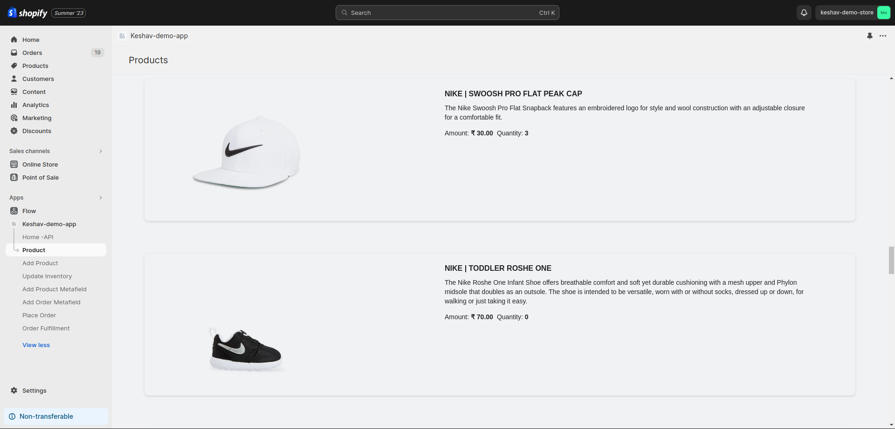

# Sample Django App

A demo app created using Django and ShopifyAPI `v8.4+`.

## Quick start

To run this app locally, you can clone the repository and do the following.

1. Create a `.env` file to specify this app's `API key` and `API secret key` app credentials that can be found in the Shopify Partners dashboard.

```ini
SHOPIFY_API_KEY=<The API key app credential specified in the Shopify Partners dashboard>
SHOPIFY_API_SECRET=<The API secret key app credential specified in the Shopify Partners dashboard>
APP_URL=<The public app URL specified in the Shopify Partners dashboard>
SCOPES=<Scopes needed for the app>
```

> **Note:** It's recommended to follow along the tutorial _[Build a Shopify App with Node and React](https://shopify.dev/apps/getting-started/create#get-a-shopify-api-key)_ to understand how to retrieve the `API key` and `API secret key` app credentials.

2. Run the following to install the required dependencies:

```console
$ pip install -r requirements.txt
```

3. Change directories to the main `sample_django_app` app and run all pending migrations:

```console
$ cd sample_django_app
$ python manage.py migrate
```

4. Ensure ngrok is running on port `8000`:

```console
$ ngrok http 8000
```

5. In a new terminal, run the server:

```console
$ python manage.py runserver
```

6. Create an `APP_URL` environment variable based on the URL ngrok gives you. This is used in the `CSRF_TRUSTED_ORIGINS` and `ALLOWED_HOSTS` section of `settings.py`. Do not include a schema (http:// or https://) in this variable.

```ini
export APP_URL=<ngrok-url.ngrok.io>
```

7. From the Partner dashboard, update the "App URL" and "Allowed redirection URL(s)" to include the callback URL:

```
<https://ngrok-url.ngrok.io>/auth/shopify/callback
```

8. In your browser, open the `https` ngrok url to install and open this app on a shop. Requests to authenticated resources like the `products` view in the `api` app should now be secured with an `Authorization: Bearer <session token>` header.




# Changes Made to make it work [15-08-2023]

## Hey, I have made certain changes in this project to make it work as intended.

1. After following all the steps mentioned above, open ngrok base url then you will be redirected to `login` url.

2. At login url, enter shopify store domain ex: `keshav-demo-store.myshopify.com`

3. If everything works well, then you will be redirected to your store .

## Lets understand Project file structure.

1.  Mainly there are 4 folders
    1. **api (django app)**
    2. **home (django app)**
    3. **sample_django_app (django project, contains settings.py)**
    4. **shopify_app (django app)**

    ### Lets Discuss all one by one.

    #### 1. The `api` app contains `urls.py` and `views.py` it is used to serve api requests that are made through our app that is embedded (yes we have embedded django template file in shopify store 😊).

    It uses a `@session_token_required` decorator for getting the context of session and perform query on shopify. This will only work when we make api requests using `shopifyAuthenticatedFetch()` from our app in shopify dashboard.

    #### 2. The `home` app is the app which we can treat it as normal django app. However I have made few changes in the decorators `@known_shop_required` so that it can work perfectly and also added few template files (.html) for embedding our app in admin dashboard, discussed about this in later in this section.

    We have to wrap our function based views in `@xframe_options_exempt @known_shop_required @latest_access_scopes_required` so that it can get executed for our embedded apps.
    
    1. `@xframe_options_exempt` is for allowing our template to get embedded thus exempting xframe

    2. `@known_shop_required` is for getting required session based on shopify store. we have made certain changes in it so that it can work perfectly. You don't have to bother about changes, just use it.

    3. `latest_access_scopes_required` is used in conditional rendering of our template so that we can take actions if some scope changes in our partner app.

    #### 3. The `sample_django_app` is the project folder which contains `settings.py` and most import our root route file i.e. `urls.py`. You can add more url route paths in this file as per your requirements.

    `settings.py` file will work out of the box however if you want to alter it feel free to do so.

    #### 4. The `shopify_app` app is the app where most of the magic happens. It has definition for all the decorators we use and all the different function necessary for authentication and session creation and management. It also contains a model for storing shop details (name, access_token etc.)
    
    I have also altered few decorators and functions to enhance its usage. You may find comments ending with "- KJ" wherever I have made changes.

    NOTE: I have added some more webhooks and also added a function to get all the webhooks and delete all the registered hooks and register it again every time our apps get authenticated.

2. Templates

    There are mainly 2 templates directory:
    1. ( shopify_app/templates/shopify_app )[default]
    2. ( home/templates/home )[custom made]
    
    a. Default template is just the template that you have seen when you tried authenticating your app with the store (box with a field to enter store name).
    
    b. Templates inside home app are the templates which gets embedded in the shopify admin dashboard.
    Lets explore about these tamplates and how it gets rendered in shopify dashboard.

    Inside home directory of the **home/templates/** there is a folder named *utils* which contains a `base.html`. This is the base html file for all other templates that are embedded into admin dashboard.

    `base.html` contains several cdns for [app-bridge](https://shopify.dev/docs/api/app-bridge) and [polaris](https://polaris.shopify.com/). Which provides base for *nav-link* and *shopifyAuthenticatedFetch*.

    I have passed *api_key* and *shop_origin* in each template for creating app instance in app-bridge.

    There are multiple templates, each perform its own intended function, some using data that is passed through **home/views/function** *context* and some using data that is fetched from **api/views** *response*.

    ## NOTE: Several classes of shopify was not working as intended. So I had to make GET/POST requests by my own to perform certain actions. You will find comments for this in the respective views.

    # ENJOY! FEEL FREE TO UPDATE THIS IF YOU WANT.
